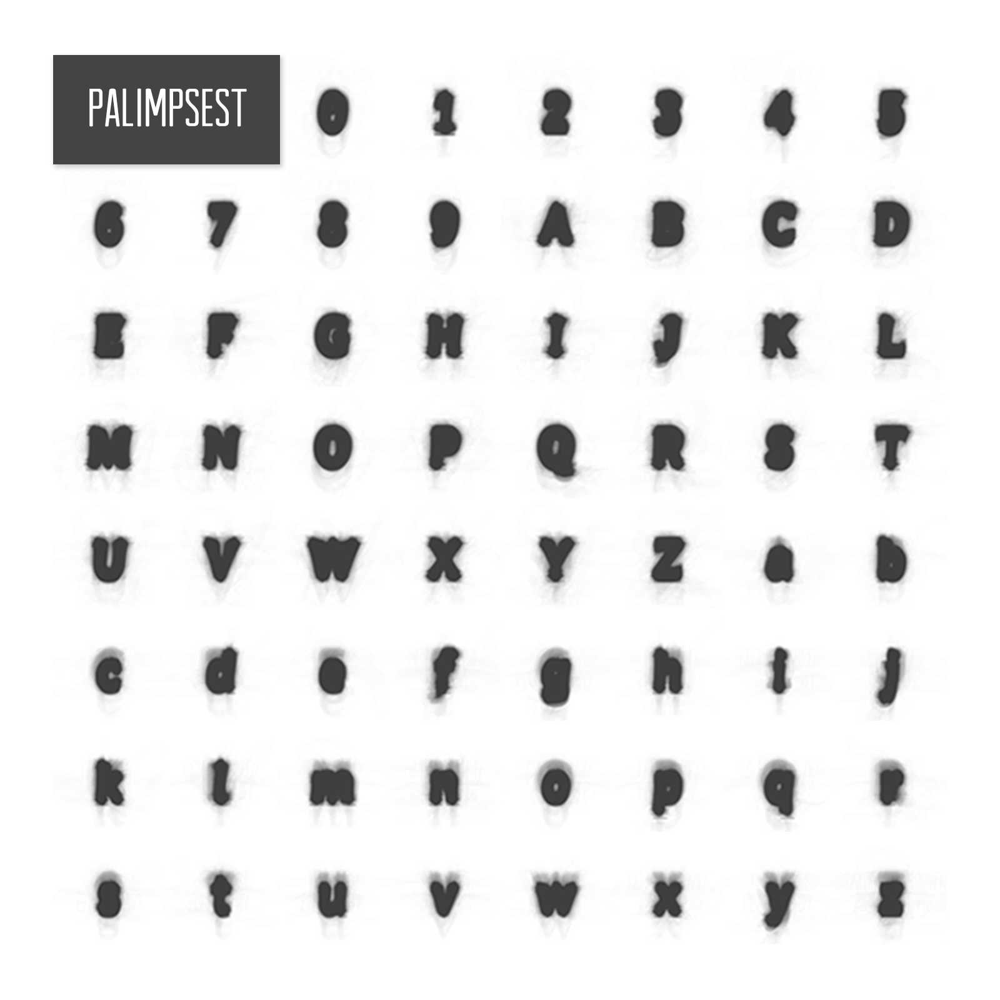
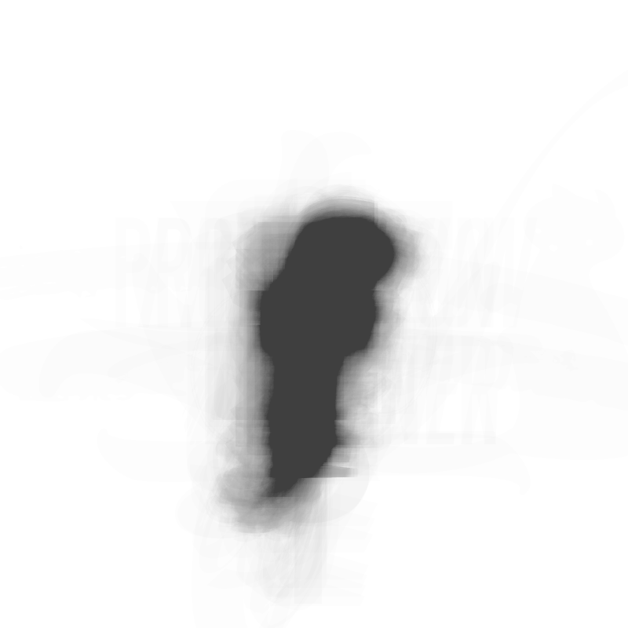
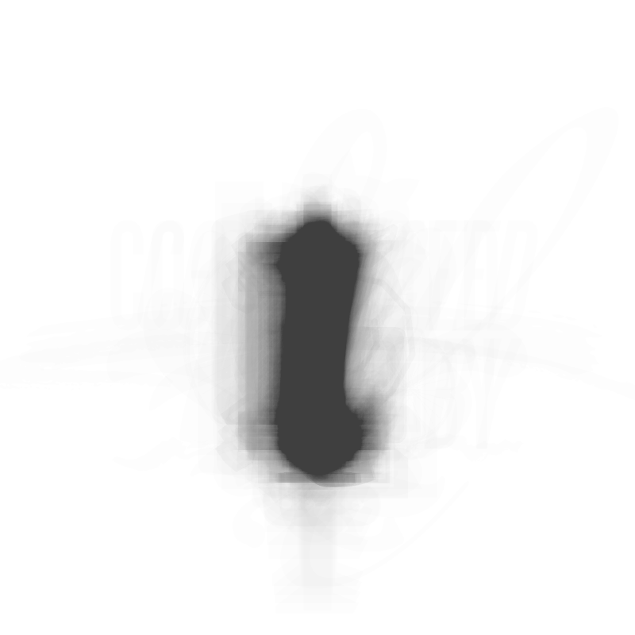
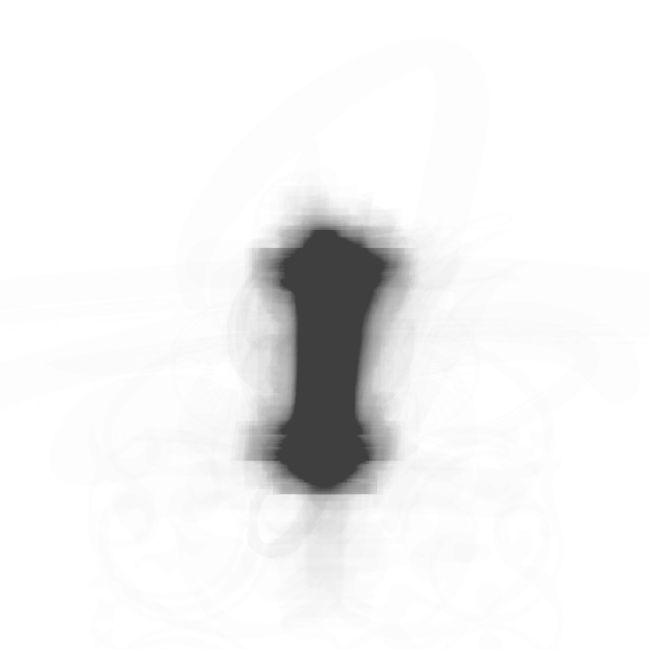

# palimpsest
Displays a palimpsest—a generated specimen of the 'average' shapes of numbers and letters, using all fonts on the system, overlaid at 20% opacity.

## Examples
Some images! These were generated using almost 3500 fonts, excluding more unusual fonts.

Lowercase `f` | Lowercase `l` | Uppercase `I`
--- | --- | ---
 |  | 

## Ideas
* Analyse percentage of overlap for each character to determine the most and least 'average' characters
* Design an 'average' font based on the palimpsest
* Generate palimpsests using fonts created by year to identify any progression in type trends over time (thanks [Rohan Jhunja](https://www.instagram.com/rohanjhunja/) for the [idea](https://www.instagram.com/p/BdKSAc5He7I/?taken-by=kayserifserif)!)
